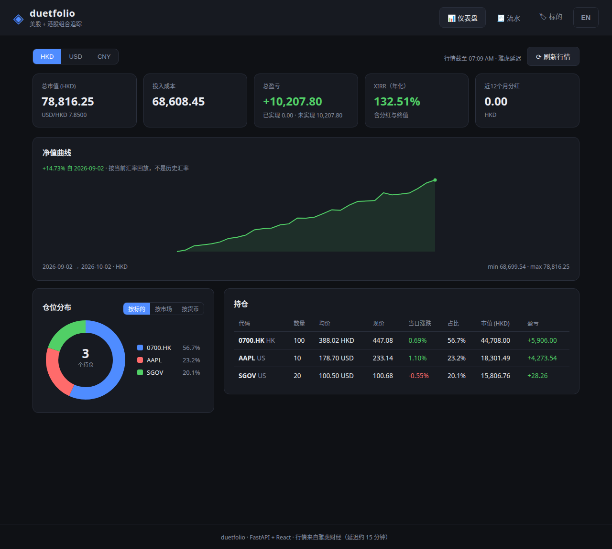

[简体中文](README.md) | **English**

# duetfolio ◈

**Hold both US and HK stocks? This tool tells you exactly how much you've made.**



Say you bought a Treasury ETF in the US and a money-market ETF in Hong Kong — two markets, two currencies, and every day you wonder "in HKD terms, am I up or down overall?" Doing that conversion in your head gets old. duetfolio pulls quotes from both markets, converts everything into your chosen base currency (HKD/USD/CNY), and gives you one number: total value, total P&L, and true annualized return including dividends.

## What it does for you

- 📈 **US + HK in one place** — see holdings across both markets without switching apps
- 💱 **Auto-converted to your currency** — USD and HKD positions converted at live FX rates into HKD (or USD/CNY)
- 🧮 **True annualized return (XIRR)** — not just "up X%", but an annualized rate computed from the actual timing and amounts of every buy, sell and dividend
- 🧾 **Holdings derived from your trade log** — you just record "bought N shares at $X on this date"; quantities and average cost are computed automatically, no spreadsheet maintenance
- 🔌 **Two quote sources** — Yahoo Finance by default (zero setup, ~15min delayed); switchable to East Money push2 (closer to real-time, no API key)

## Quick start (Windows, beginner-friendly)

You only need Python ([download here](https://www.python.org/downloads/), tick **Add python.exe to PATH** during install), then:

1. Click the green **Code** button on this repo → **Download ZIP**, extract it
2. Double-click **`start-all.bat`** in the extracted folder and wait for both windows (backend + frontend)
3. Open [http://127.0.0.1:5173](http://127.0.0.1:5173) in your browser — that's your portfolio dashboard: total value, P&L, XIRR, allocation donut

> Backend API docs only: double-click `start.bat`, then open [http://127.0.0.1:8000/docs](http://127.0.0.1:8000/docs)
> Manual frontend start: `cd frontend && npm install && npm run dev` (needs Node.js 18+)

If the page loads, you're up. Now let's record your first holding.

## First use: record a holding

Open the API docs page at [http://127.0.0.1:8000/docs](http://127.0.0.1:8000/docs) — everything below is point and click:

**Step 1: add an instrument** — find `POST /api/instruments`, expand it → **Try it out** → replace the request body with:

```json
{"symbol": "SGOV", "name": "iShares 0-3 Month Treasury Bond ETF", "market": "US", "currency": "USD", "asset_type": "etf"}
```

For HK stocks, append `.HK` (note: Yahoo drops leading zeros, so `03152` becomes `3152.HK`):

```json
{"symbol": "3152.HK", "name": "Bosera HKD Money Market ETF", "market": "HK", "currency": "HKD", "asset_type": "etf"}
```

**Step 2: refresh quotes** — find `POST /api/prices/refresh` → **Try it out** → **Execute**. `"failed": []` means quotes came through.

**Step 3: record your buy** — find `POST /api/transactions` and fill in your real trade:

```json
{"instrument_id": 1, "type": "buy", "date": "2026-09-28", "quantity": 2, "price": 100.66, "fee": 1.99}
```

(`instrument_id` is the `id` from step 1's response; for dividends use `"type": "dividend"` — then `quantity × price` = dividend amount received and `fee` = withholding tax/fees, deducted from the dividend.)

**Step 4: see the total** — open [http://127.0.0.1:8000/api/portfolio/summary?base=HKD](http://127.0.0.1:8000/api/portfolio/summary?base=HKD) for total value, P&L and XIRR in HKD.

> Day to day, there's only one thing to do: hit `POST /api/prices/refresh`, then check the summary.

## FAQ

**How do I write HK tickers?**
Yahoo Finance drops the leading zero: `03152` → `3152.HK`, `00700` → `700.HK`. US tickers as-is: `AAPL`, `SGOV`.

**How is total P&L computed?**
Total P&L = unrealized (current price − remaining cost) + realized (sells & dividends, net of fees). "Invested" is the cost of your **remaining** position, not cumulative cash in.

**Why is my XIRR absurdly large?**
XIRR is annualized — a 0.1% gain over 4 days annualizes to an extreme number. That's the math, not a bug. The longer you hold, the more realistic it gets. Each cashflow converts at the FX rate of its **transaction date** (captured automatically), so currency moves don't leak into your investment return.

**How fresh are the quotes?**
Yahoo Finance is ~15min delayed. For closer to real-time, switch to the East Money source: close the backend window, run `$env:MARKET_PROVIDER="eastmoney"` in PowerShell first, then start (hint included in `start.bat`).

**How is the net-worth curve drawn?**
Each day's total = quantity held that day × that day's close. It only uses price snapshots already in the DB (never triggers a live fetch). Historical days are converted with today's FX rate (no historical FX is stored), so treat old absolute values as approximate — the shape is trustworthy.

**Where is my data?**
In a local SQLite file on your machine (`backend/duetfolio.db`). Nothing is uploaded anywhere.

## Tech stack (for developers)

| Layer | Choice |
|---|---|
| Backend | FastAPI, SQLAlchemy 2.0, Alembic, Pydantic v2 |
| Database | SQLite (zero-config default) / PostgreSQL (via `DATABASE_URL`) |
| Market data | yfinance (default) / East Money push2 (`MARKET_PROVIDER=eastmoney`) |
| Frontend | React 18 + Vite, hand-rolled SVG charts |
| Deploy | Docker Compose (`docker compose up --build`) |

Migrations run automatically on startup. Quote sources are a pluggable `BaseProvider` architecture (see `backend/app/services/market.py`).

## Disclaimer

Quote data is delayed and may be inaccurate. This tool is for personal tracking only, not investment advice.

## License

MIT

## Buy me a coffee

If this project saved you some time, consider buying me a coffee. ☕

| Alipay | WeChat Pay |
| ------ | ---------- |
|  |  |
